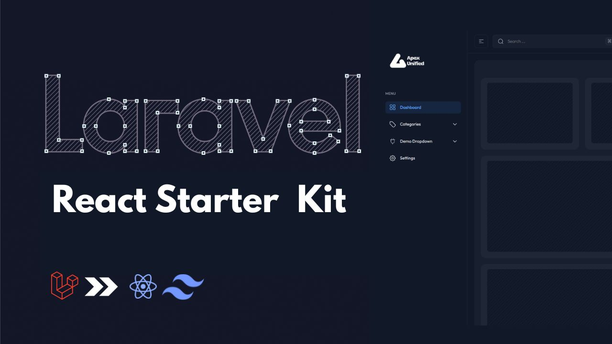

# 🚀 Laravel + React + Inertia Starter Kit

A modern, developer-friendly Laravel Starter Kit built with **Laravel**, **React + Inertia.js**, and **Tailwind CSS**. This Starter Kit is designed to streamline your development workflow with clean architecture, powerful tools, and an elegant UI — including support for **dark/light mode**, **rich file uploads**, and more.



---

## 🧱 Stack

- ✅ **Laravel 12+**
- ⚛️ **React** with **Inertia.js**
- 🎨 **Tailwind CSS**
- ✅ **Rich Components**
- ☁️ **FilePond** for advanced file uploading
- 🌑 Light & Dark Theme Support
- 🔁 Redis Support for Caching & Queues

---

## ✨ Key Features

### ✅ Modified Auth with Queued Emails

- Auth scaffolding is completely modified.
- **Queued password reset & email verification** for improved UX.
- **Throttle email verification requests**:
    - When a verification email is sent, a timer is started.
    - The user cannot request another verification email until the timer expires.
    - This prevents **spamming** and **unnecessary mail traffic**.
    - Gracefully Error Handling.

---

### ⚙️ Dynamic Settings Configuration

#### 🛠 General Settings

- Easily manage app name, email, phone, logos, and favicons from a centralized UI.
- No need to modify `.env` or config files for branding changes.
- Fully cached via Laravel's `Cache` system to **prevent repeated DB queries**.

#### ✉️ SMTP Configuration

- Configure SMTP settings directly from the admin panel.
- **No need to touch `.env`**.
- Cached dynamically in the service provider to ensure **fast, DB-less performance**.

#### 🧠 Redis Ready

- Supports Redis for both `CACHE` and `QUEUE`.
- Just set the following in your `.env`:

    ```env
    CACHE_DRIVER=redis
    QUEUE_CONNECTION=redis
    ```

## 📦 Installation Guide

Use this if you want to Quick Start The Project.

```bash
composer create-project apexunified/laravel-react-starterkit
```

Use this if you want to Manually Setup the project.

```bash

git clone https://github.com/ApexUnified/Laravel-React-StarterKit.git my-awesome-app
cd my-awesome-app

# Run one-time script to:
# - cp .env.example .env
# - composer install
# - php artisan key:generate
# - php artisan migrate
# - npm install
# - npm run build
# - php artisan serve
```
